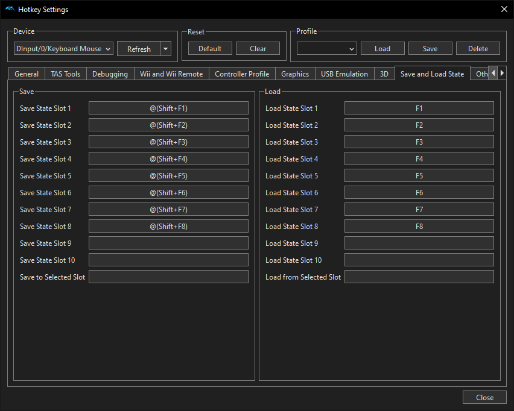

# Save state like a dolphin emulator

`Shift` + `Escape` to open save slot file location.\
`Shift` + `Fn` to save state slot `n`.\
`Fn` to load state slot `n`.\
(1 <= `n` <= 8)
## **Recommand to disable Steam Cloud**
